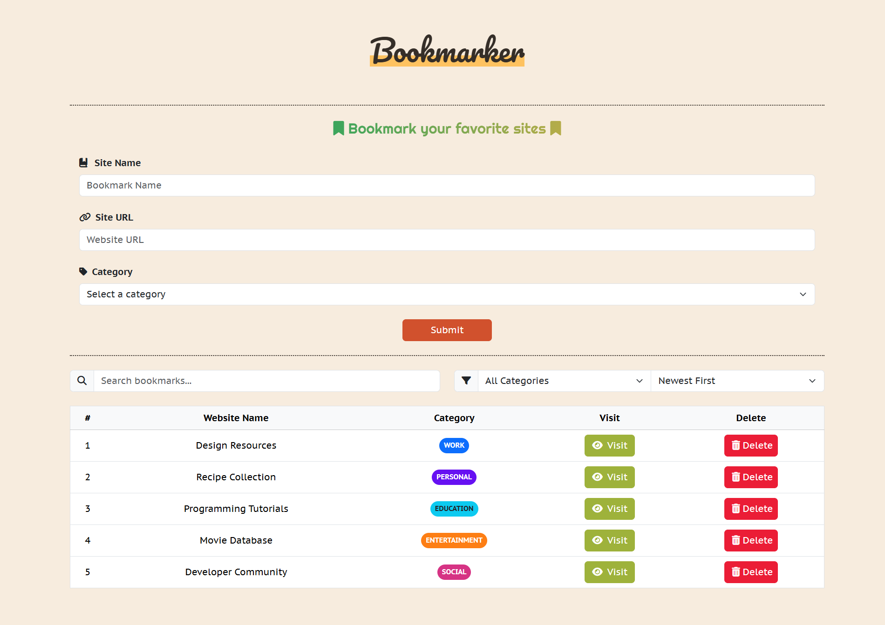

# 🔖 Bookmark Manager

<div align="center">
  
  <h3>Save and organize your favorite websites with ease</h3>
  <p>A modern web application for managing website bookmarks with advanced organization features</p>
</div>

## 📋 Project Overview

This project was developed as part of the [Route Academy](https://www.linkedin.com/company/routeacademy/) Full Stack Development Program, a 12-month intensive training program. It represents the third JavaScript assignment in the curriculum, focusing on implementing CRUD operations in a web application.

## 💫 Interface Preview

<div align="center">
  
  
  <a href="docs/ui-screenshots" style="display: inline-block; margin-top: 15px; padding: 8px 16px; background: linear-gradient(45deg, #4CAF50, #2E7D32); color: white; text-decoration: none; border-radius: 6px; font-weight: bold; box-shadow: 0 2px 4px rgba(0,0,0,0.2); transition: all 0.3s ease;">
    <span style="vertical-align: middle; font-size: 0.9em;">📸 View All Screenshots</span>
  </a>
</div>

## ✨ Features

- ➕ **Add bookmarks** with name, URL, and category
- ✅ **Validate inputs** before submission with real-time feedback
- 🏷️ **Categorize bookmarks** (Work, Personal, Education, Entertainment, Social, Other)
- 🔍 **Search functionality** to quickly find bookmarks
- 🗂️ **Filter bookmarks** by category
- 📊 **Sort bookmarks** by date added or name (A-Z, Z-A)
- 🌐 **Visit websites** directly from the application
- 🗑️ **Delete bookmarks** with confirmation dialog
- 📱 **Responsive design** for all devices
- 💾 **Local storage** for data persistence

## 🛠️ Technology Stack

<div align="center">

### 🎨 Frontend Technologies
[](https://skillicons.dev)

### 📚 Libraries & Frameworks
[](https://sweetalert2.github.io/)
[](https://fontawesome.com/)
[](https://getbootstrap.com/)

### 💻 Development Tools
[](https://code.visualstudio.com/)
[](https://git-scm.com/)
[](https://github.com/)

</div>

## 📁 Project Structure

```
Bookmark Manager/
├── css/
│   ├── all.min.css (Font Awesome)
│   ├── bootstrap.min.css
│   ├── main.css (Custom styles)
│   └── sweetalert-custom.css
├── images/
│   └── bookmark.png
├── js/
│   ├── bootstrap.bundle.min.js
│   ├── index.js (Main application logic)
│   └── sweetalert-config.js
├── webfonts/ (Font Awesome icon fonts)
├── docs/
│   ├── project-requirements.md
│   └── ui-screenshots/
│       └── Hero.png
├── index.html
├── README.md
└── .gitignore
```

## 🚀 How to Use

1. Clone the repository
   ```bash
   git clone https://github.com/MohamedV0/Bookmarker.git
   ```
2. Open `index.html` in your browser
3. Add bookmarks by filling out the form and clicking "Submit"
4. Search, filter, and sort your bookmarks using the controls
5. Click "Visit" to open a bookmarked website
6. Click "Delete" to remove a bookmark

## 📊 Code Organization

The JavaScript code follows a modular pattern with separate objects for:

- **DOM**: References to HTML elements
- **PATTERNS**: Regular expressions for validation
- **BookmarkManager**: Core functionality for managing bookmarks
- **UI**: Handles rendering and display
- **Validator**: Input validation
- **Utilities**: Helper functions

## ✅ Requirements Fulfilled

This implementation meets and extends the [original project requirements](./docs/project-requirements.md):

| Requirement | Implementation |
|-------------|----------------|
| Create functionality | ✅ Add new bookmarks with name, URL, and category |
| Read functionality | ✅ Display bookmarks in a responsive table |
| Update functionality | ✅ Sort and filter existing bookmarks |
| Delete functionality | ✅ Remove bookmarks with confirmation |
| URL validation | ✅ Regular expression pattern matching |
| Clean UI | ✅ Modern design with Bootstrap and custom CSS |
| Enhanced features | ✅ Categories, search, sort, and responsive design |

---

<div align="center">
  <p>Developed with ❤️ by <a href="https://github.com/MohamedV0">Mohamed Ashraf</a> as part of <a href="https://www.linkedin.com/company/routeacademy/">Route Academy</a> Full Stack Program</p>
  <p>
    <a href="https://github.com/MohamedV0"></a>
    <a href="mailto:mohamed.ashraf.v0@gmail.com"></a>
    <a href="https://www.linkedin.com/in/mohamed-ashraf-v0/"></a>
    <a href="https://mohamedv0.netlify.app/"></a>
  </p>
</div>